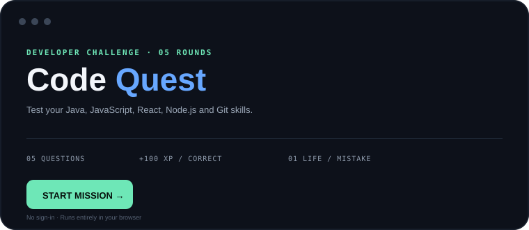

# 👋 Hi, I'm Abhay Singh Bais

  <strong>Still learning · Still building · Still curious.</strong> 
  I enjoy turning ideas into useful web experiences and growing through hands-on development.

### 🧰 What I work with

`Java` · `JavaScript` · `React` · `Node.js` · `HTML` · `CSS` · `Git`

### 🎮 Code Quest

I built a small developer challenge for visitors to my profile — 5 quick rounds covering Java, JavaScript, React, Node.js and Git.

**[⚡ Play Code Quest](https://abhaysinghbais10.github.io/abhaysinghbais10/)** · *No sign-in required*

### 🚀 Featured projects

- **NeighbourHelp** — a web platform focused on connecting neighbours and sharing local help/resources.
- **Tic-Tac-Toe** — a JavaScript game built while sharpening frontend fundamentals.
- **Stone Paper Scissors** — a lightweight browser game built with HTML, CSS and JavaScript.

### 📌 Currently

- Building full-stack projects
- Practicing problem solving & DSA
- Learning by shipping small, complete products

> **Keep building.**
